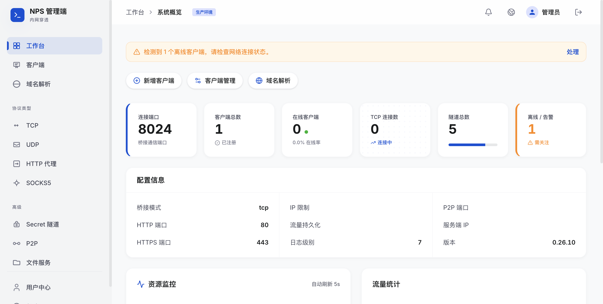

# NPS Admin · Intranet Penetration

[English](README.md) | [中文](README_zh.md)

This repository builds on the [NPS](https://github.com/ehang-io/nps) server with a **renewed web console** (React + TypeScript + Vite): dashboard, client & tunnel management, grouping, notifications, user center, and zh/en UI.



## Console highlights

- **Dashboard**: bridge port, client/tunnel stats, config summary, resource & traffic views  
- **Navigation**: clients, domain resolution, tunnels by protocol (TCP/UDP/HTTP/SOCKS5, etc.), advanced entries, help, and user center  
- **Account**: password change in user center (admin updates `web_password` in `conf/nps.conf`; multi-user mode updates client records)  
- **API**: compatible with existing nps HTTP APIs and session auth; frontend lives under `nps-desgin/`

## Run & develop

### Server (Go)

Build and run from the repo root (the binary must sit next to `conf/` so `conf/nps.conf` loads):

```bash
CGO_ENABLED=0 go build -o nps ./cmd/nps
./nps
```

Web port is defined in `nps.conf` (`web_port`, often `8080`). Change default credentials before production.

### Web UI (local dev)

```bash
cd nps-desgin
pnpm install
pnpm dev -- --host 0.0.0.0 --port 3000
```

Point the dev server at your local nps HTTP endpoint (see `nps-desgin` Vite / API config).

## Docs & config

- Server: `conf/nps.conf`  
- UI notes: see `docs/` when present

## License & credits

Server core follows the NPS ecosystem; the admin UI is maintained in this repo. Use and distribution are subject to the project’s open-source license.
